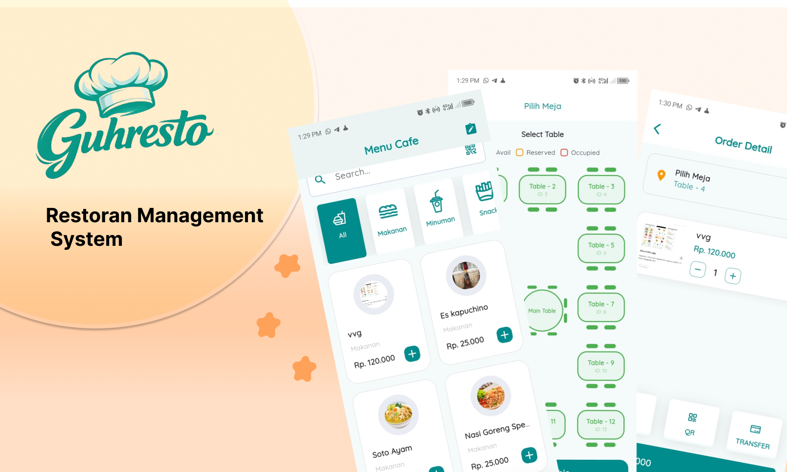
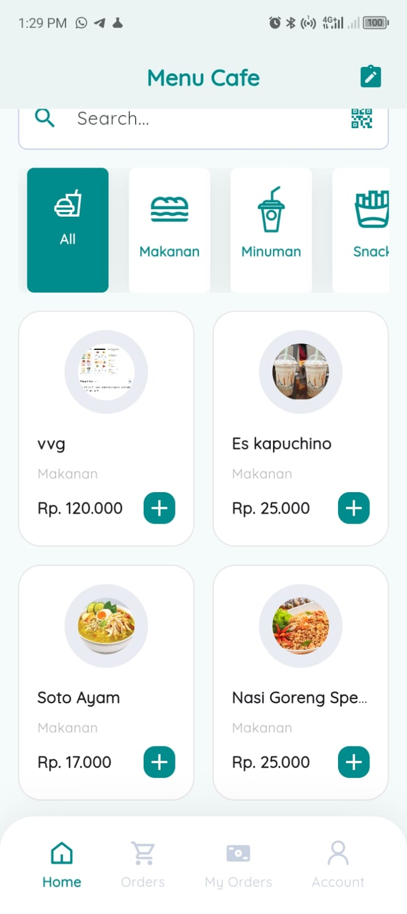
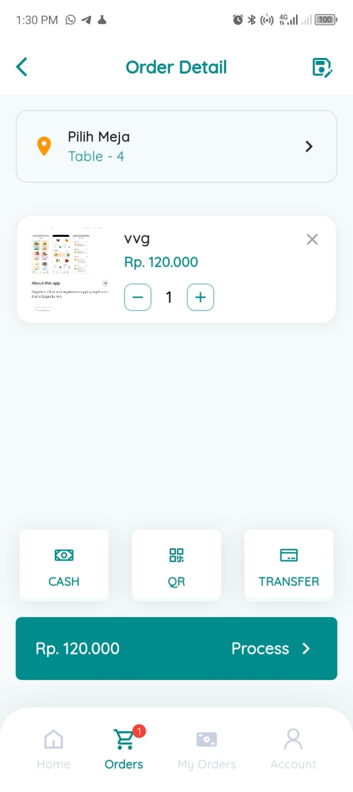
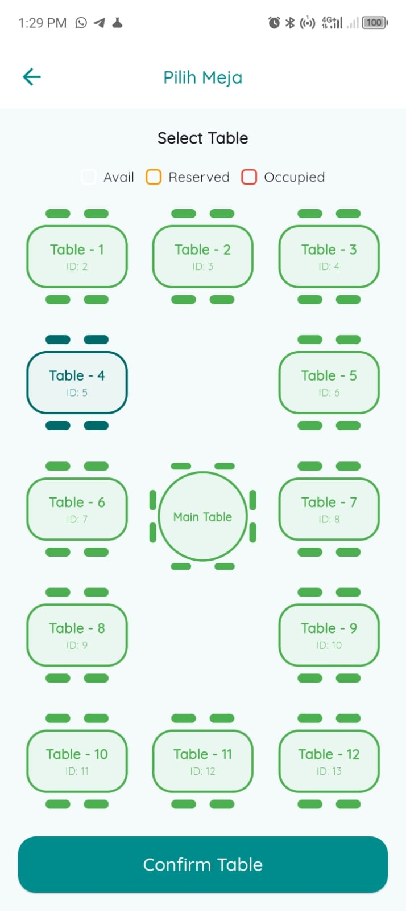
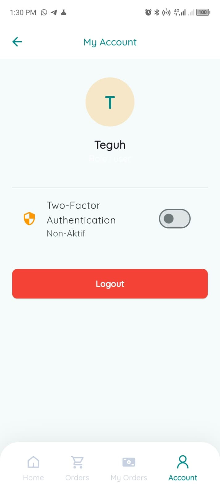
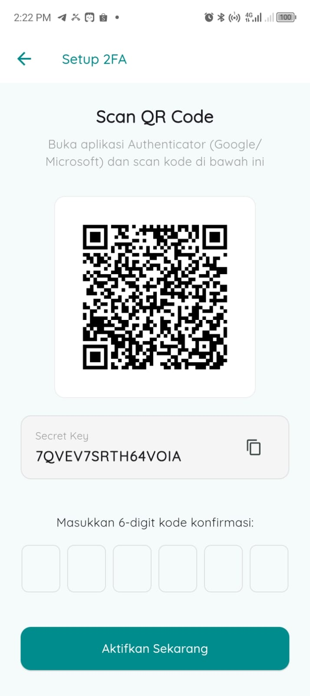
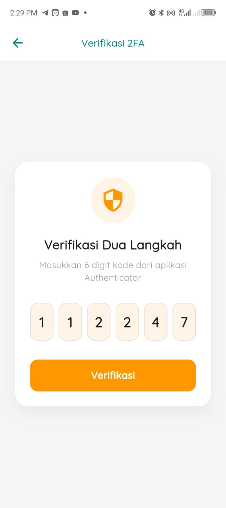

  

**RestoGuh Mobile** adalah aplikasi client yang terintegrasi dengan backend Laravel 11.  
Aplikasi ini digunakan untuk kebutuhan kasir (POS), monitoring pesanan, dan manajemen transaksi secara real-time.

  Aplikasi Mobile POS & Restaurant Management System berbasis Flutter,BLOC,Freezed

  

---

---

## ✨ Fitur Utama

### 🔐 Authentication
- Login menggunakan API
- Support JWT / Sanctum Token
- Secure Logout
- 2FA Verification Support

---

### 🛒 POS (Point of Sales)
- Tambah produk ke keranjang
- Hitung total otomatis
- Input nominal bayar
- Generate order ke backend
- Status transaksi: Pending / Done

---

### 📦 Order Management
- Lihat daftar pesanan
- Filter berdasarkan status
- Update status order
- Sinkronisasi data dengan server

---

### 🔄 Offline Support (Local Storage)
- Simpan transaksi ke SQLite
- Sync otomatis saat online
- Status `isSync` untuk tracking

---

### 👤 User Info
- Tampilkan nama kasir
- ID kasir tersimpan
- Session management

---

## 🧱 Tech Stack

- Flutter 3.x
- Dart
- HTTP 
- SQLite (sqflite)
- Provider / State Management
- REST API Integration
- JSON Serialization

---

## 📸 Screenshots Interface

<h3>🏠 Home</h3>

  

<h3>🗂 Orders</h3>

  

<h3>🛒 Product Management</h3>

  

<h3>Pilih Meja</h3>

  

<h3>Enable 2FA Auth</h3>

  

<h3>Setup 2 FA Login</h3>

  

<h3>Verify 2 FA Login</h3>

  

